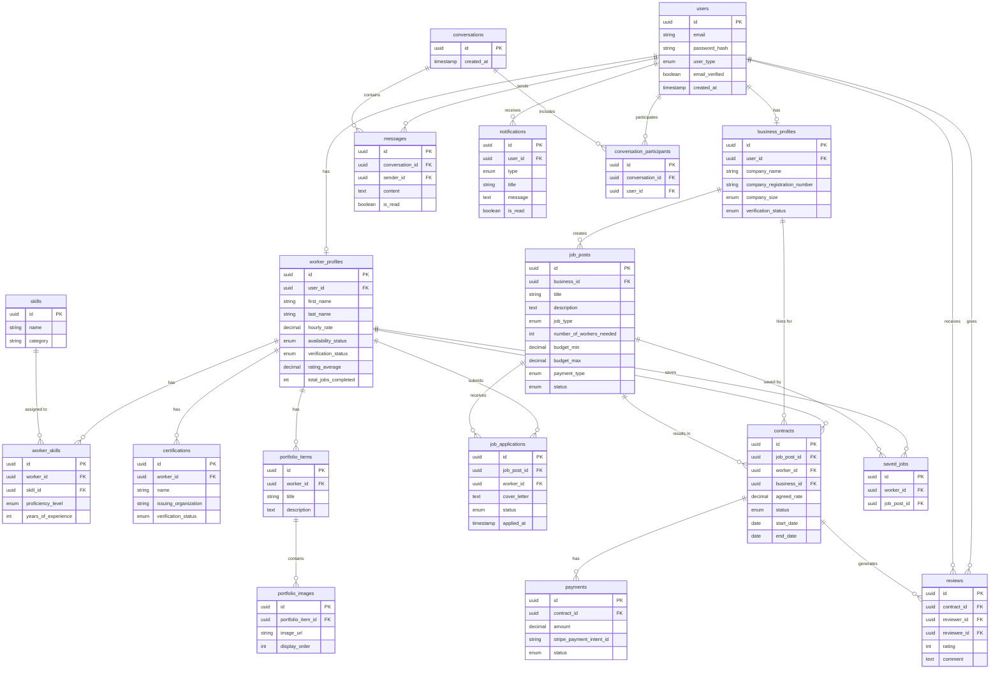
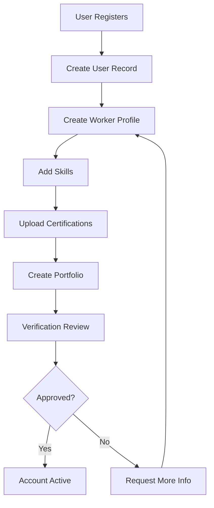
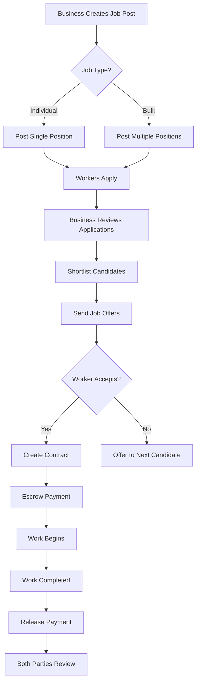
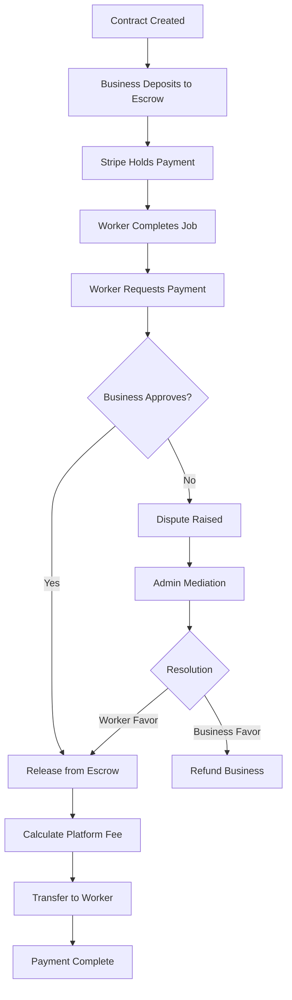
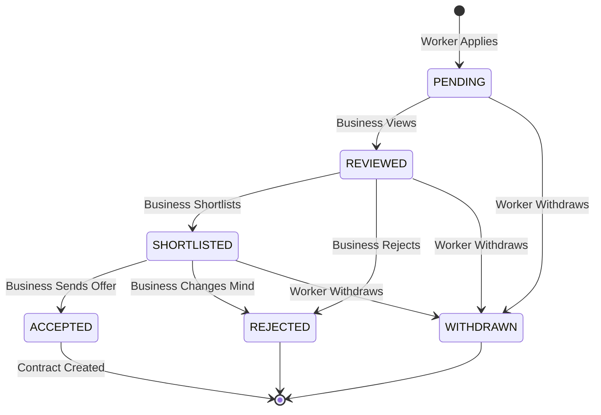
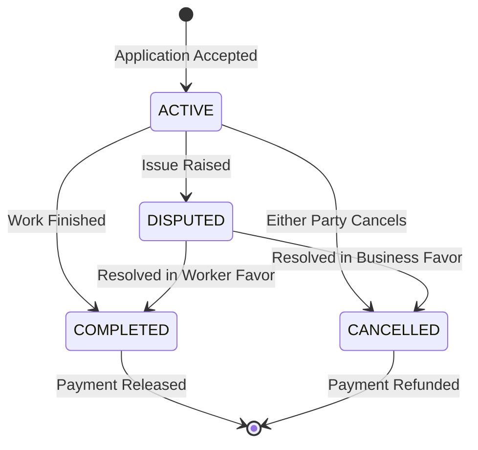

# Database Entity Relationship Diagram

## Full Schema Diagram



---

## Core Workflows

### 1. Worker Onboarding Flow



### 2. Job Posting & Hiring Flow



### 3. Payment Flow



### 4. Application Status Flow



### 5. Contract Lifecycle



---

## Key Relationships Explained

### 1. User -> Profile (Polymorphic)
- One `User` can have either a `WorkerProfile` OR `BusinessProfile`
- Determined by `user_type` enum
- Enforced at application level (not database constraint)

### 2. Worker -> Skills (Many-to-Many)
- Workers can have multiple skills
- Skills can belong to multiple workers
- Junction table: `worker_skills`
- Includes metadata: `proficiency_level`, `years_of_experience`

### 3. Job -> Applications (One-to-Many)
- One job receives many applications
- Each application linked to one worker
- Unique constraint: one worker can only apply once per job

### 4. Contract -> Payments (One-to-Many)
- One contract can have multiple payments (milestone payments)
- Each payment linked to one contract
- Tracks payment status and Stripe integration

### 5. Contract -> Reviews (One-to-Many, Bidirectional)
- One contract can have 2 reviews (worker reviews business, business reviews worker)
- Each review linked to one contract
- Unique constraint: one review per reviewer per contract

---

## Data Flow Examples

### Example 1: Creating a Complete Worker Profile

```typescript
// 1. Create user account
const user = await prisma.user.create({
  data: {
    email: 'john@example.com',
    passwordHash: hashedPassword,
    userType: 'WORKER',
    emailVerified: true,
  },
});

// 2. Create worker profile with skills
const workerProfile = await prisma.workerProfile.create({
  data: {
    userId: user.id,
    firstName: 'John',
    lastName: 'Doe',
    hourlyRate: 50.00,
    locationCity: 'New York',
    locationState: 'NY',
    skills: {
      create: [
        {
          skillId: plumbingSkillId,
          proficiencyLevel: 'EXPERT',
          yearsOfExperience: 10,
        },
      ],
    },
    certifications: {
      create: [
        {
          name: 'Licensed Plumber',
          issuingOrganization: 'State Board',
          issueDate: new Date('2015-01-01'),
        },
      ],
    },
  },
});
```

### Example 2: Bulk Hiring Process

```typescript
// 1. Create bulk job post
const bulkJob = await prisma.jobPost.create({
  data: {
    businessId: businessId,
    title: 'Need 10 Plumbers for Commercial Project',
    jobType: 'BULK',
    numberOfWorkersNeeded: 10,
    budgetMin: 50,
    budgetMax: 75,
    // ... other fields
  },
});

// 2. Workers apply
// (Multiple workers create job_applications)

// 3. Business bulk accepts 10 workers
const acceptedApplications = await prisma.jobApplication.findMany({
  where: {
    jobPostId: bulkJob.id,
    status: 'SHORTLISTED',
  },
  take: 10,
});

// 4. Create contracts for all accepted workers
const contracts = await prisma.contract.createMany({
  data: acceptedApplications.map(app => ({
    jobPostId: bulkJob.id,
    workerId: app.workerId,
    businessId: businessId,
    contractType: 'BULK_MEMBER',
    agreedRate: 60.00,
    startDate: new Date(),
  })),
});
```

---

## Indexing Strategy

### High-Priority Indexes (Already in Schema)

```sql
-- Worker discovery
CREATE INDEX idx_worker_location ON worker_profiles(location_city, location_state);
CREATE INDEX idx_worker_verification ON worker_profiles(verification_status);
CREATE INDEX idx_worker_availability ON worker_profiles(availability_status);

-- Job search
CREATE INDEX idx_job_status ON job_posts(status);
CREATE INDEX idx_job_type ON job_posts(job_type);
CREATE INDEX idx_job_published ON job_posts(published_at);

-- Application tracking
CREATE INDEX idx_application_worker ON job_applications(worker_id);
CREATE INDEX idx_application_status ON job_applications(status);

-- Contract management
CREATE INDEX idx_contract_worker ON contracts(worker_id);
CREATE INDEX idx_contract_business ON contracts(business_id);
CREATE INDEX idx_contract_status ON contracts(status);

-- Messaging
CREATE INDEX idx_message_conversation ON messages(conversation_id);
CREATE INDEX idx_message_sender ON messages(sender_id);

-- Notifications
CREATE INDEX idx_notification_user ON notifications(user_id);
CREATE INDEX idx_notification_read ON notifications(is_read);
```

### Additional Composite Indexes (Consider Adding)

```sql
-- Find available verified workers in location
CREATE INDEX idx_worker_search ON worker_profiles(
  verification_status,
  availability_status,
  location_city
);

-- Find active jobs by business
CREATE INDEX idx_business_active_jobs ON job_posts(
  business_id,
  status
) WHERE status = 'ACTIVE';

-- Worker application history
CREATE INDEX idx_worker_applications ON job_applications(
  worker_id,
  status,
  applied_at DESC
);
```

---

## Performance Considerations

### Query Optimization Tips

1. **Use select instead of include when possible**
   ```typescript
   // ❌ Fetches all fields
   const worker = await prisma.workerProfile.findUnique({
     where: { id },
     include: { skills: true }
   });

   // ✅ Fetches only needed fields
   const worker = await prisma.workerProfile.findUnique({
     where: { id },
     select: {
       firstName: true,
       lastName: true,
       hourlyRate: true,
       skills: {
         select: {
           skill: {
             select: { name: true }
           }
         }
       }
     }
   });
   ```

2. **Implement pagination**
   ```typescript
   const jobs = await prisma.jobPost.findMany({
     skip: (page - 1) * limit,
     take: limit,
     orderBy: { createdAt: 'desc' }
   });
   ```

3. **Use database-level filtering**
   ```typescript
   // ✅ Filter in database
   const workers = await prisma.workerProfile.findMany({
     where: {
       ratingAverage: { gte: 4.0 },
       totalJobsCompleted: { gte: 10 }
     }
   });
   ```

4. **Batch operations when possible**
   ```typescript
   // Instead of multiple creates, use createMany
   await prisma.notification.createMany({
     data: users.map(user => ({
       userId: user.id,
       type: 'SYSTEM',
       title: 'Update',
       message: 'New feature released!'
     }))
   });
   ```

---

This diagram and documentation should help you understand the complete database structure and relationships in your gig platform!
